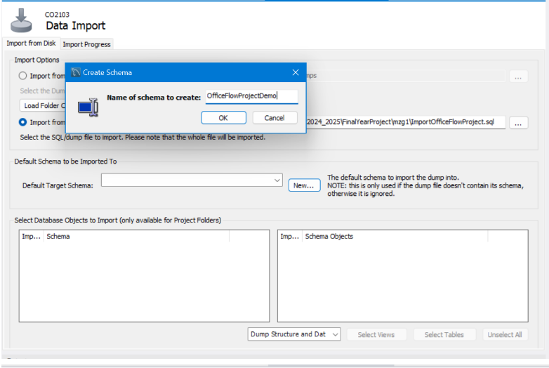
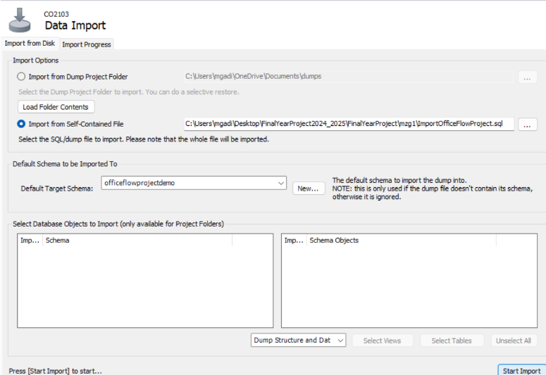
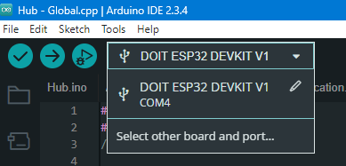

# Smart Home Office Health system

# Content in the repo
+ Electronic scripts - These are all the code files for all the devices that were developed in Arduino IDE. There is also a folder called "libraries". To avoid you installing each library, when you open up the code in Arduino IDE, go to File -> Preferences -> Ensure the sketchbook location url is pointing to the "Electronic scripts" folder, so the libraries will automatically get included.  
+ Web Application - This is the Java web application to run in Intellij which contains the API and user interface.
+ My dissertation... all 17000+ words :D
+ ImportOfficeFlowProject.sql - This is the latest database readings that were exported from my ongoing "testing" period of running the system in the background whilst I worked. 
+ Images and screenshots - They are for this README file.

# Running the application overview
There are 2 following sections, one for running the application with only the test database readings collected over the past month, and one for running the application alongside the hardware. Please use Windows 11 and Google Chrome if possible.
## HTTPS Setup
This project uses HTTPS via a Java KeyStore ('keys.jks'). For security reasons, this file is not included in the repository.
To generate your own keystore, run the following command and place the file in ../Web Application/src/Main/resources:
keytool -genkeypair -alias tomcat -keyalg RSA -keystore ./keys.jks
This will open up an interactive dialog for you to fill in the relevant details.
Remember the keystore and key password you have entered, and edit application.properties with your matching details.

# Running the application without hardware devices but with the database readings I have gathered for over a month
On the GitLab repo there is a file called ImportOfficeFlowProject.sql. This is my latest exported database (before May 2nd). To import it, which allows you to test the software application with existing data without needing to use the hardware devices, do the following steps.
+ Download the SQL file
+ Download/pull the contents in "Web Application" to your machine. Open the application in Intellij IDEA (I deleveloped in 2024.3.1 Ultimate Edition). 
+ Open MySQL Workbench and locate the 'server' you want to be running the database on. 
+ Open it then find the left Navigator pane which looks like this: 
+ Go to the "MANAGEMENT" section, click "Data Import/Restore".
+ A new pane will open, select the option to "Import from Self-Contained File" then select the downloaded SQL file from your file explorer.
+ For the "Default Target Schema" click the "New..." button and enter "OfficeFlowProject" like so (here I have added "Demo" to the end because I already have the correct schema set up):

+ Click "OK" to complete creating it, and then select the created schema from the drop down list. Creating it does not automatically select it for you. 
+ After these steps, your final result should look like this: 
+ Click "Start Import" on the bottom right and wait for the loading to complete.
+ To check the import has worked correctly, open a new query pane and run this script:
use officeflowproject;
select * from sensorreading order by timestamp desc;
This should show recent readings near May 2nd. If nothing appears, the import has failed.
+ Go to your opened IntelliJ window, and open src -> main -> resources -> application.properties and update lines 6,7 and 8 with your MySQL Workbench database details.
+ Run the application
+ Go to https://localhost:8443/login to access the web application, the username is "mzg1@student.le.ac.uk", the password is "bob"
+ You should now be able to explore the application

# Running the application with the hardware devices from scratch (no database records)
+ Download/pull the contents in "Web Application" to your machine. Open the application in Intellij IDEA (I deleveloped in 2024.3.1 Ultimate Edition). 
+ Please create a database in MySQL workbench called "officeFlowProject" .
+ Open src -> main -> resources -> application.properties and update lines 6,7 and 8 with your MySQL Workbench database details.
+ Go to src -> main -> java -> com.example.officeFlow -> FinalYearProjectApplication.java and uncomment lines 55 to 212 - these are the static set up records.
+ Run the application
+ Go to src -> main -> java -> com.example.officeFlow -> FinalYearProjectApplication.java and comment back lines 55 to 212 (The static records should only be ran once). 
+ Go to https://localhost:8443/login to access the web application. You will need to register an account.
+ Download the Hub's hardware files from the Gitlab repo, all of them are in the Hub folder in Electronic scripts. 
+ Open the Arduino IDE -> File -> Open -> Then select the downloaded Hub.ino file. When the IDE opens it, it will include all the cpp and h files in that directory.
+ Go on your phone and turn on mobile hotspot
+ Connect your computer to the mobile hotspot's AP
+ Open the command terminal on your computer and enter ipconfig/ifconfig and find your computer's private ip address.
+ Open "Global.cpp" in the opened Arduino window and locate the line starting with 'String serverName = "https://192.168...";'. Replace the ip address there with yours. The final version should still contain '"https://' and ':8443"';
+ Power on the Hub, click on here to click the port that will appear -  . If the device type says "Unknown", you will need to open and select the "DOIT ESP32 DEVKIT V1" board. You can see if it has connected successfully by looking at the bottom right of the IDE, where it'll say "[\connected]". 
+ Click the upload button, wait for it to finish. 
+ From observation, it is pretty rare that a connected device on a mobile hotspot will have its private ip address changed (unless you restart your phone). So it is safe to disconnect and reconnect on this network whenever needed for this testing purpose without changing the Global.cpp address again. 
+ The purpose of this ip address handling was to get the hub and the server (where the application is running on the computer) on the same network, so they could communicate with each other, as there is no exposed public ip address. In a live production environment, the servername would be pointed to a real domain name, like "www.officeFlow.com" instead of an ip address. So if you are not running the application on the mobile hotspot network, then the private ip address will be different, and the hub will not be able to reach the server.
+ Now you will be able to use the hardware with the application.

# Using the hardware
+ I have made 7 devices: Hub, Occupancy sensor, Light sensor, Lamp, Temperature Sensor, Fan, and Heart rate sensor. These should be seen as separate "products" you have bought, and my application has a set up process for how you set up your network - just follow the steps after you register, I designed them to be as less "user dependent" as possible. 
+ The devices are not battery powered, I have been using a 7 port USB extender to provide power to each device, as my laptop only has 2 USB ports. So when the instructions say to "Power it on", it means clicking the corresponding power button on the extender. It doesn't matter which order the wires are plugged in on the extender. A point to note: The port extender does have power distribution issues, and particularly affects circuits where 5V is required (this is covered in dissertation). Wiggling the wire can cause the device to restart due to this issue - you can tell if this happens if the device goes back to the initialisation set up colours, such as orange. This is NOT a device issue, so if you want to assess the functionality of a specific device thoroughly, I suggest connecting it to a direct USB port on your laptop/PC. However, even if the issue comes into play at the time of testing, you do not need to do anything as there is a self-healing process in place where the device will be reconnected within 2 minutes (you will notice this via the LED colour changes). To prevent this issue, please try to not move the USB wires or touch the circuit components whilst they are running.
+ If you have any user related questions, please see the FAQ page.
+ If you accidentally disconnected any connector wires on the breadboards, please turn off the device immediately. Depending on which wire, it can cause a component to overheat and melt, and smoke to appear.
+ If you want to look at the serial monitor output (I have left simple debugging lines), then locate the targeted device's port on the IDE (this port name changes a lot when powered off and on), connect to it, then close and open the serial monitor by clicking on the right side icon on the top right 
+ If you notice any unexpected behaviour on the circuits, it is most likely that there is a loose connection somewhere on the breadboard (I should be there to recognise the problem, but the main culprits will most likely be the connector wires handling the power input, pushing them in or bending them will resolve the issue)

#
